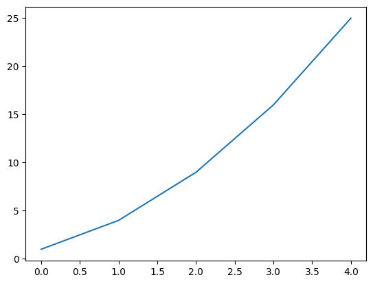
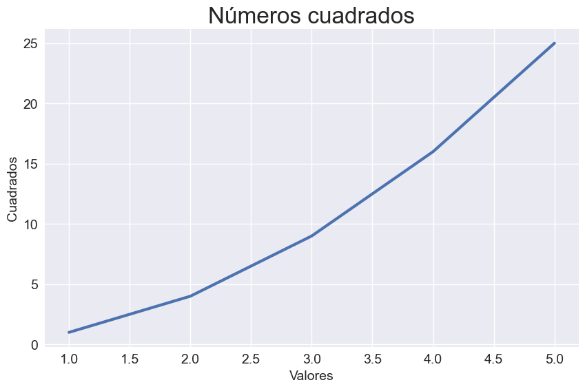
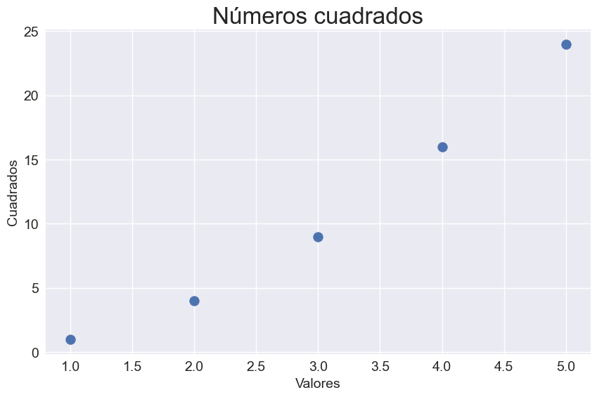
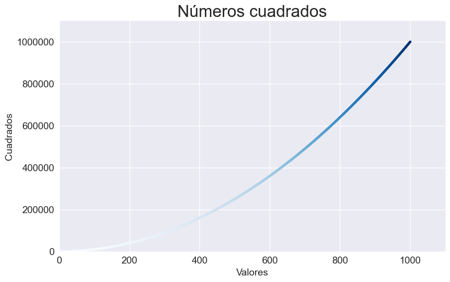

# Python para Visualización de Datos

Este repositorio contiene mis **prácticas** y **pequeños proyectos** basados en los capítulos sobre **visualización de datos** del siguiente libro.

        

## Contexto
Este libro introduce el análisis de datos de forma práctica a través de 3 capítulos:

- Generación de Datos
- Visualización de Datos usando librerías de Python
- Procesamiento de archivos CSV, JSON y GeoJSON
- Manejo de APIs

## Tecnologías utilizadas
  

  
  

## Proyectos
- Simulación de caminos aleatorios(**Random Walks**)
- **Análisis de probabilidad** en dados
- **Visualización de datos** climáticos
- **Mapeo** de datos geográficos sobre terremotos
- Análisis de datos con **GitHub API**

## Estructura de directorios del proyecto
    python-data-visualization/                 
    ├── data  
    ├── docs   
    ├── notebooks
    │   └── 00_generando_gráficos.ipynb
    ├── outputs/
    │   └── images/  
    ├── readme_figures
    ├── src
    └── tests

## Ejemplos
### Primeros gráficos

    
    
    
        

### Random walks

## Conclusión